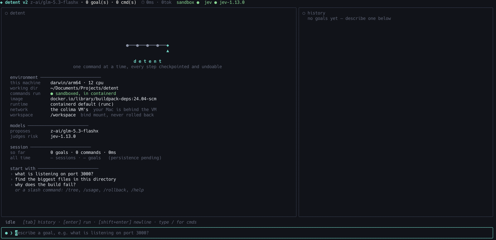
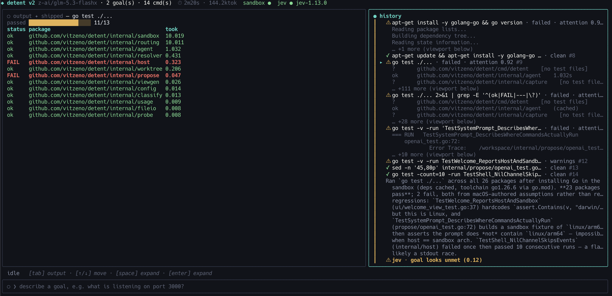
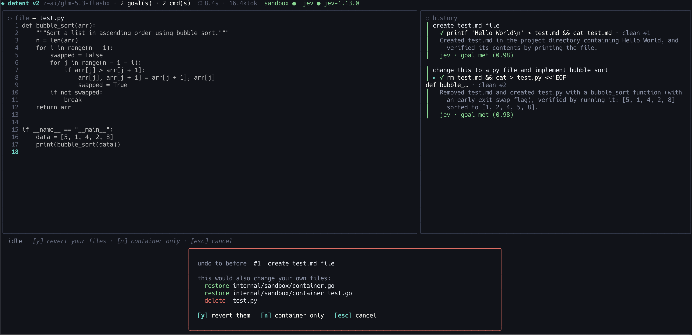
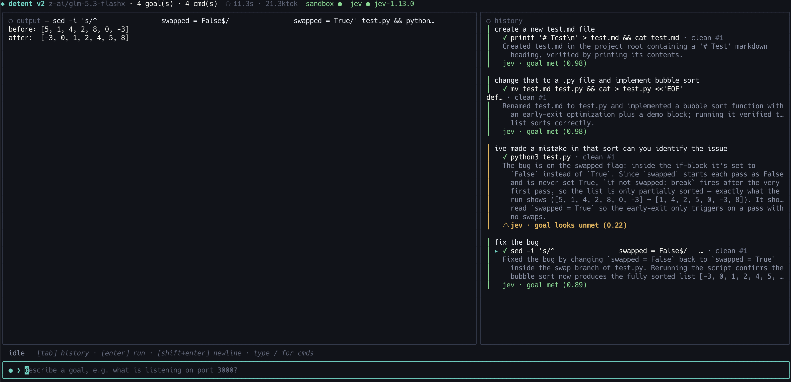
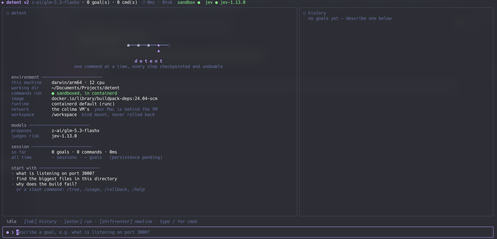

# detent

A TUI that pairs a small or local LLM with a human to drive a shell.

You give it a goal. The model proposes one `sh -c` command at a time, the
harness runs it, feeds the output back, and repeats until it's done. Risky
commands stop and ask you. Everything is checkpointed, so you can undo.

Works with any OpenAI-compatible `/chat/completions` endpoint: LM Studio by
default, OpenRouter or OpenAI too.



```sh
make build && ./bin/detent          # sandboxed (needs containerd, see below)
./bin/detent -sandbox host          # straight on your machine
make run-headless GOAL="find go files over 1MB"
```

---

## What it does

| | |
| --- | --- |
| **One command at a time** | No batches. Every step is reviewable and separately undoable. |
| **Confirm only when it matters** | A second model (TypeSafe Jev) plus a regex backstop flags the dangerous ones. Everything else runs through. |
| **Undo** | `/rollback 7` restores the container to before step 7 and trims the transcript to match. |
| **Sandboxed by default** | One containerd container per session. Your working dir is bind-mounted at `/workspace`. |
| **Output that reads** | The pane picks a rendering per output shape, and can ask a model to design one. |
| **One transcript** | Every goal shares it, compacted at goal boundaries once it outgrows its budget. |
| **A log you can query** | One JSONL file per session, every record tagged with the step it belongs to. |

## Reading the output

The pane draws from a *view spec*: a parse saying how to read the bytes into
rows, and blocks saying how to draw them. Thirty widgets, eight parse
kinds: tables and trees, but also gauges, histograms, box plots,
stacked bands, gantt charts, braille scatter plots and heatmaps.
Detent ships specs for common commands and picks a sensible default otherwise.

Set `views: generate` and it will ask the model to design one for output
nothing covers, check it actually binds against the real bytes, have Jev score
it, and save the winner. The second run of that command is free.



The header says where the framing came from, and only when a model had a hand
in it: `✦ generated`, `✦ saved`, or `✦ generate declined` when it tried and
nothing survived. Detent's own renderings say nothing.

**The model never writes your data.** It writes a regexp and picks widgets;
the interpreter runs that regexp over real output. A spec can point at the
wrong field, which drops the view. It cannot put a value on screen that the
command never printed.

## Undoing a step



Each sandboxed step carries a dim `#N`, numbered across the session.
`/rollback N` undoes step N **and everything after it**.

Your own files are a separate question. `/workspace` is a bind mount, not part
of the snapshot, so detent shows what reverting would change and asks first.
The default answer is the safe one: roll the container back, leave your files.
Paths that changed *after* the last checkpoint are marked `⚠ not detent's`,
because nothing detent ran accounts for those.

## Safety, stated plainly

- Commands run straight through unless flagged **Dangerous**, which shows the
  literal text and waits for you.
- Without a Jev key, only the regex backstop applies.
- The session bar always says where commands run: `sandbox ●` or
  `host ⚠ unsandboxed`.
- Colour carries status; prose never does. Anything the model wrote renders
  dimmed, so a confident sentence can't look like a result.



## Keys

| Key | Does |
| --- | --- |
| `enter` | run the goal in the input box |
| `/` | command list: `/rollback`, `/tree`, `/usage`, `/new`, `/abort`, `/quit` |
| `esc` | abort the running goal |
| `tab` | cycle input → history → output |
| `↑` `↓` | move through history, or scroll the focused pane |
| `enter` *(output pane)* | act on the selected row, into the prompt |
| `space` | expand the focused row |
| `ctrl+s` | save the file open in the editor |
| `ctrl+c` | quit |

`alt+enter` or `ctrl+j` inserts a newline. For `shift+enter`, bind it in your
terminal to send `\x1b\r`; terminals send the same byte for both otherwise.

## Themes

`dark`, `light`, `solarized`, `dracula` via `theme:` or `DETENT_THEME`.



## Sandboxing

```sh
brew install colima                        # macOS
colima start --runtime containerd
```

On Linux, run containerd and point `sandbox_socket` at it. Rollback restores
container state only: the workspace bind mount is deliberately outside the
snapshot.

## Configuration

`./.detent.yaml` or `~/.config/detent/config.yaml`. Every key is documented in
[`detent.example.yaml`](detent.example.yaml). Precedence: flags > env > file >
built-ins.

Common env vars: `DETENT_BASE_URL`, `DETENT_MODEL`, `DETENT_API_KEY`,
`TYPESAFE_API_KEY`, `DETENT_VIEWS`, `DETENT_SANDBOX_MODE`, `DETENT_LOG_LEVEL`.
A repo-local `.env` is loaded too.

## Logs

One JSONL stream per session at `~/.local/state/detent/logs/`. One file, not
one per component, because the thing you investigate is a step and a step
crosses several of them:

```sh
jq 'select(.step == 7)'                    everything about step 7
jq 'select(.event | startswith("view."))'  why the output looked like that
```

## Architecture

```
cmd/detent  →  ui  ⇄  resolver  ⇄  agent  →  propose, classify, usage, worktree
                                      ↑
                                   routing  →  host     (unsandboxed)
                                            →  sandbox  (containerd)

viewspec, logging  →  stdlib only, importable by anything
```

`ui` and `agent` never import each other; `resolver` translates. `ui` depends
on nothing under `internal/`, which is why it lives outside it.

[CLAUDE.md](CLAUDE.md) has how the code is arranged and why.
