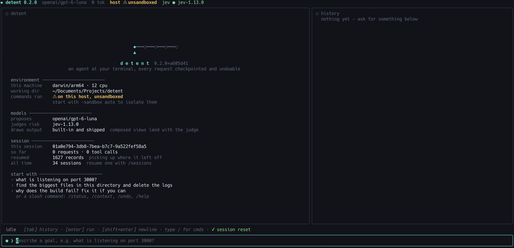
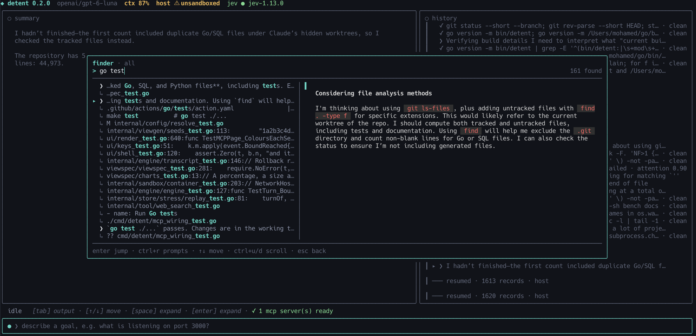

# detent

## Quick start

```sh
go install github.com/vitzeno/detent/cmd/detent@latest   # needs Go 1.26
detent -init        # writes ~/.config/detent/config.yaml
                    # set api_key in it, or export DETENT_API_KEY
detent
```

It talks to OpenRouter by default so any OpenAI-compatible `/chat/completions` endpoint with tool calling works

Just set `base_url` and `model` in the config for LM Studio or OpenAI

Commands run on your machine, and anything flagged dangerous waits for you to approve it. On Windows that needs PowerShell 7 or Git Bash, see [Windows](#windows)

<table>
  <tr>
    <td width="50%"><br><sub><b>Welcome</b>: the model, where commands run, and what it resumed</sub></td>
    <td width="50%"><br><sub><b>Finder</b>: ctrl+r over the session, then jump to it</sub></td>
  </tr>
</table>

## Architecture

Everything is an event on a single bus and every part of detent is a subscriber

Nothing calls the engine itself including logging and the TUI. They just listen and write what they hear, same with the SQLite log that makes a session resumable, as is the judge that decides how a call went

If any of them are removed everything else runs unchanged

Future extensions are expected to subscribe and publish to the event bus too

Events are split into facts and intents, facts for what happened, intents for what someone wants to happen

Either can come from anyone. The engine publishes most facts, but the store, the judge and MCP publish their own

```
  publishes                   bus      subscribes
                               │
  engine ───── facts ───────→  │  ──→  engine     intents only
    │                          │  ──→  ui         draws, publishes back intent (e.g. new prompt)
    ├── tool                   │  ──→  headless   one request, no TUI
    ├── model                  │  ──→  logging    the JSONL stream
    └── routing                │  ──→  store      SQLite allows resume
          ├── host             │  ──→  judge      how the tool call went
          └── sandbox          │  ──→  viewgen    how to draw it
                               │
  anyone ───── intents ─────→  │
```

`ui` imports nothing under `internal/`, both sides import `event`, which depends on the standard library and `viewspec`

All extensions listen, publish, or both

## Configuration

`./.detent.yaml` or `~/.config/detent/config.yaml`

`detent -init` writes a commented starting config to `~/.config/detent/config.yaml` for you to set your key in. It never replaces a config you already have, and as written it changes nothing, so built-in defaults keep reaching you until you set a value

A directory's own `.detent.yaml`, `.env` and `.mcp.json` can point your key at another endpoint or start programs, so the first time you run detent there it shows what they would do and asks before reading them. A yes is remembered until one of them changes. `-prompt` runs never ask and ignore them unless you pass `-trust`

All keys are documented in [`detent.example.yaml`](internal/config/detent.example.yaml), the same file `-init` writes, an unknown key will prevent detent from starting.

## MCP

Server details go in `.mcp.json`, pretty much the standard so one written for another client works here too

`~/.config/detent/mcp.json` and `./.mcp.json` merge, nearest wins
Also `${VAR}` expands from the environment, so a committed file can name a token it does not hold

```json
{
	"mcpServers": {
		"github": {
			"command": "docker",
			"args": ["run", "-i", "--rm", "ghcr.io/github/github-mcp-server"]
		},
		"linear": { "type": "http", "url": "https://mcp.linear.app/mcp" }
	}
}
```

`./bin/detent -mcp` connects and lists what each offers. `/mcp` shows the
same from inside

A remote server that answers 401 gets a sign-in link in the output pane. `o` opens
it, `c` copies it, and the token is kept in `~/.local/state/detent/mcp/` so the
next launch does not ask again. Claude Code's `oauth` object (`clientId`,
`clientSecret`, `callbackPort`, `scopes`) is read for providers that need it.
`/mcp auth <server>` signs in again

These tool calls run in detent's process, not the container, and no checkpoint
undoes one. So every MCP tool call is confirmed, whatever the server says about
itself

## Skills

A skill is a folder with a `SKILL.md` in it: a name, a description, and instructions for one kind of task. They follow the [Agent Skills](https://agentskills.io) format, so ones written for Claude Code, Codex or Cursor work here as they are

```
.agents/skills/release/
├── SKILL.md
└── scripts/tag.sh
```

detent looks in `.agents/skills/` and `.claude/skills/` from the git root down, then in `~/.agents/skills/` and `~/.claude/skills/`. If two share a name, the project's wins

The model only sees names and descriptions until a request fits one, then it loads that skill. You can ask for one yourself with `/release cut v2.1`, and `/skills` lists what was found

`disable-model-invocation: true` keeps a skill for you to call by hand, `user-invocable: false` leaves it to the model

Scripts in a skill run like any other command, through the same approvals. In the sandbox your own skills are mounted read-only

## Instructions

detent reads the instruction files a project keeps for coding agents and adds them to the model's prompt

`AGENTS.md`, or `CLAUDE.md` where a directory has no `AGENTS.md`, in each directory from the git root down to where you started detent. The nearest one wins where they disagree

`~/.config/detent/AGENTS.md` is your own, read first in every project

Together they are capped at 128KB, about 32k tokens, cutting the outermost file first. That suits a large-window model, but on a small local one the files can take most of the context, so keep them short there. `/status` lists which were read

## Tools

| Tool         | Does                              |
| ------------ | --------------------------------- |
| `bash`       | runs a command                    |
| `read_file`  | reads a file, a window at a time  |
| `write_file` | writes a whole file               |
| `edit_file`  | replaces an exact piece of a file |
| `list_dir`   | lists a directory                 |
| `grep`       | searches file contents            |
| `find_files` | finds files by name               |
| `web_search` | searches the web                  |
| `skill`      | loads a skill, when there are any |

On this machine the file tools, `skill` and `web_search` run as Go inside detent, so they behave the same on macOS, Linux and Windows. In the sandbox each one is a shell command instead, and either way it goes through the same checks. The read-only ones run together

`edit_file` and `write_file` come back as a diff, drawn side by side when the pane is wide enough

A command still running after 10 minutes is stopped, and the model is told so along with what it printed. `command_timeout` in the config changes it

`web_search` is a curl to DuckDuckGo, read through `r.jina.ai`, so there is no API key. In the sandbox it needs network, which is the default there

## Your own commands

`shift+tab` switches the input bar between prompt and shell. The border
turns amber and the prompt becomes `$` for visual distinction.

Anything you run is fed to the model afterwards as a message in the transcript

```
[human ran a command in the sandbox]
$ git status --short
exit 0
 M ui/keys.go
```

## Finder

`ctrl+r` opens a fuzzy finder over everything in this session, press enter to jump to it in history.

Pressing `ctrl+r` again narrows search to requests, commands or outputs

## Undoing

`/undo 2` trims the transcript to before your second request

When the directory is inside a git repository, detent checkpoints your files with git before each request, without touching your index, branch or stash.

In sandbox mode undo also restores the container to its snapshot, and commands you ran yourself go back with it. Your working directory is mounted at `/workspace`

## Windows

Commands run on this machine, since the sandbox needs containerd. Both the model's commands and yours go to PowerShell 7 (`winget install Microsoft.PowerShell`), or to Git Bash.

## Sandboxing (**Experimental**)

Commands run on this machine by default. `-sandbox auto`, or `sandbox_mode: auto` in the config, runs them in a containerd container instead

```sh
brew install colima
colima start --cpu 6 --memory 8 --disk 30 --kubernetes=false
```

On Linux, run containerd and point `sandbox_socket` at it.

Each session gets its own container and`./bin/detent -prune` can be used to clean up in case of orphaned containers

## Headless Mode

`-prompt` runs one request without the TUI and prints what it does

```sh
detent -prompt "find go files over 1MB"
detent -prompt "..." -unattended      # declines every flagged command instead of asking
detent -prompt "..." -approve-all     # runs them all, only for a throwaway container
```

It exits 0 when the request is done, 1 on an error, 3 at the step limit, 4 when stopped and 130 when aborted. Headless runs leave MCP out: no config is read and no server is started

## Benchmarking

[`bench/harbor`](bench/harbor) runs detent on Terminal-Bench through Harbor, against other agents on the same model

## Resuming

Every session is recorded to `~/.local/state/detent/events.db`, so it
can be replayed rather than reconstructed.

```sh
detent -sessions                    # what can be resumed
detent -resume last                 # continue the most recent
detent -resume <id>                 # or a specific one
detent -resume "the sandbox bug"    # or one you named
```

## Generative Output (**Experimental**)

Currently thirty widgets over nine parse kinds, including
gauges, histograms, box plots, gantt charts, braille scatter plots and
heatmaps

With `views: generate` and a Jev key it designs a spec for output nothing
covers

Jev answers closed questions rather than writing JSON, so it cannot
name a widget or field that does not exist

All takes about 600ms, then cached

## Logs

One JSONL stream per session in `~/.local/state/detent/logs/`

```sh
jq 'select(.turn == "01a0…")'                   one request, end to end
jq 'select(.event | startswith("tool_call."))'  every tool call
jq 'select(.level == "WARN")'                   what went wrong
```

[CLAUDE.md](CLAUDE.md) has how the code is arranged and why.
