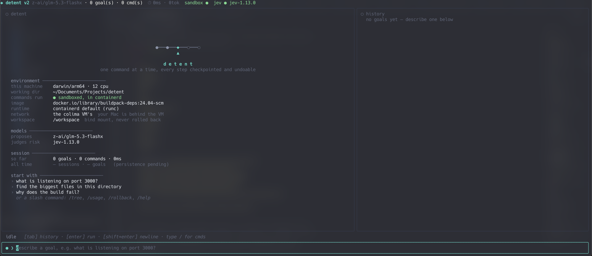
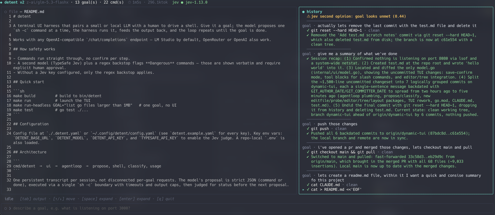

# detent

A terminal UI harness that pairs a small or local LLM with a human to drive a shell. Give it a goal; the model proposes one `sh -c` command at a time, the harness runs it, feeds the output back, and the loop repeats until the goal is done.

Works with any OpenAI-compatible `/chat/completions` endpoint — LM Studio by default, OpenRouter or OpenAI also work.

## Screenshots





## Quick start

```sh
make build         # build to bin/detent
make run           # launch the TUI
make run-headless GOAL="list go files larger than 1MB"   # one goal, no UI
make test          # go test ./...
```

By default detent runs every command **sandboxed** in a container, which needs a
containerd daemon (see below). To skip that and run straight on your machine:

```sh
./bin/detent -sandbox host
```

## Sandboxing

Commands run in a containerd-backed container, one per session, so filesystem
state builds up across steps and can be rolled back. Your working directory is
bind-mounted at `/workspace`, so edits are visible on both sides.

### macOS — colima with the containerd runtime

```sh
brew install colima
colima start --runtime containerd
```

detent looks for `~/.colima/default/containerd.sock` automatically. Check what
your VM actually exposes with:

```sh
colima status     # prints the "containerd socket:" line
```

A colima VM started with the **docker** runtime also exposes a working
containerd socket (dockerd runs on containerd underneath), so an existing
`colima start` will usually work as-is. If you use a named profile, the socket
moves to `~/.colima/<profile>/containerd.sock` and you'll need to point at it:

```sh
colima start --profile detent --runtime containerd
./bin/detent -sandbox-socket ~/.colima/detent/containerd.sock
```

### Linux

containerd runs natively; detent uses `/run/containerd/containerd.sock`. You may
need to be in a group that can read that socket, or run with sudo.

### Windows

No safe default. Run detent inside WSL2 (then it's the Linux case), or expose
containerd over TCP and pass `-sandbox-socket`.

### Known limits

- **The container shares the containerd daemon's network.** That's
  `sandbox_network: host`, the default, so goals can clone, curl and install.
  What "host" means depends on where the daemon runs:

  | Platform | Container gets | Your machine |
  | --- | --- | --- |
  | macOS | the colima VM's network | behind the VM boundary |
  | Linux | this machine's network | localhost and LAN reachable |

  Set `sandbox_network: none` for loopback only: isolated, but no DNS and
  nothing fetchable. The welcome pane says which one is live.

  An isolated bridge network with real connectivity would need CNI. `go-cni`
  shells out to plugin binaries and needs a netns on the daemon's kernel, which
  doesn't hold with the daemon in a VM, so it isn't wired up.
- **The default image is `buildpack-deps:24.04-scm`**: Ubuntu plus git, curl and
  ca-certificates, so goals have them even with `sandbox_network: none`. Point
  `sandbox_image` at something else if you need more.
- **`/new` forgets the conversation, not the container.** It clears the transcript,
  the history pane and the usage counters, so the next goal starts fresh. A
  sandbox container and anything already written inside it carry on.
- **A rollback does not revert `/workspace`.** That's a bind mount to your real
  directory, deliberately outside the snapshot, so your own files survive. Only
  container state outside the mount is restored.

## How safety works

- Commands run straight through, no confirm per step.
- A second model (TypeSafe Jev) plus a regex backstop flags **Dangerous**
  commands — those are shown verbatim and require explicit human approval.
- Without a Jev key configured, only the regex backstop applies.
- The session bar always says where commands run: `sandbox ●` or
  `host ⚠ unsandboxed`.
- Every finished goal carries Jev's own verdict on it — `jev · goal met (0.98)`,
  `only partly met`, or `looks unmet` — rather than only speaking up to disagree.
  Nothing is shown when no judge is wired, which is a different thing from a low
  score.

## Undoing a step

Every sandboxed step is checkpointed, and each one shows a dim `#N` marker in the
history pane. `/rollback N` undoes step N **and everything after it**, restoring
the container to how it was before that step ran, and trimming the transcript to
match so the model doesn't keep reasoning from undone work.

## Keys

| Key                    | Does                                                                               |
| ---------------------- | ---------------------------------------------------------------------------------- |
| `enter`                | run the goal in the input box                                                      |
| `shift+enter`          | insert a newline (needs a Kitty-protocol terminal; the status line says which)     |
| `alt+enter` / `ctrl+j` | insert a newline anywhere                                                          |
| `/`                    | open the command list (`/rollback`, `/tree`, `/usage`, `/new`, `/abort`, `/help`, `/quit`) |
| `esc`                  | abort the running goal — so does `/abort`, which stays typeable mid-run            |
| `tab`                  | cycle input → history → output                                                     |
| `↑` / `↓`              | move through history, or scroll the focused pane                                   |
| `space`                | expand the focused row's output                                                    |
| `ctrl+s`               | save the file open in the editor pane                                              |
| `q`                    | quit (when the input isn't focused)                                                |
| `ctrl+c`               | quit from anywhere                                                                 |

**Want `shift+enter` for newlines?** Terminals send the same byte for `enter` and
`shift+enter`, so no program can tell them apart by default. Bind it in your
terminal to send `\x1b\r` (escape + carriage return) and detent will read it as
`alt+enter`:

- **iTerm2** — Settings → Keys → Key Bindings → `+`, press shift+enter, action
  "Send Escape Sequence", value `\r`.
- **VS Code** — add to `keybindings.json`:
    ```json
    {
    	"key": "shift+enter",
    	"command": "workbench.action.terminal.sendSequence",
    	"args": { "text": "\r" },
    	"when": "terminalFocus"
    }
    ```

## Configuration

Config file at `./.detent.yaml` or `~/.config/detent/config.yaml` (see
`detent.example.yaml` for every key). Precedence is flags > environment > file >
built-ins.

Key env vars: `DETENT_BASE_URL`, `DETENT_MODEL`, `DETENT_API_KEY`,
`TYPESAFE_API_KEY` (enables the Jev judge), `DETENT_SANDBOX_MODE`,
`DETENT_SANDBOX_SOCKET`. A repo-local `.env` is also loaded.

## Architecture

```
cmd/detent  →  ui  ⇄  resolver  ⇄  agent  →  propose, classify, usage
                                      ↑
                                   routing  →  host     (unsandboxed)
                                            →  sandbox  (containerd)
```

`ui` and `agent` never import each other; `resolver` translates between them, so
the TUI's vocabulary and the harness's domain stay independent. `ui` depends on
nothing under `internal/`, which is why it lives outside it.

One persistent transcript per session, not disconnected per-goal requests. The
model's proposal is strict JSON (command or done), executed via a single `sh -c`
boundary with timeouts and output caps, then judged for status before the next
proposal.
