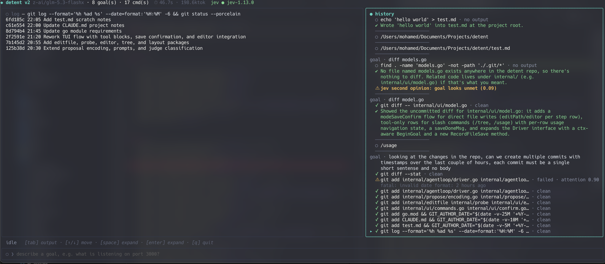

# detent

A terminal UI harness that pairs a small or local LLM with a human to drive a shell. Give it a goal; the model proposes one `sh -c` command at a time, the harness runs it, feeds the output back, and the loop repeats until the goal is done.

Works with any OpenAI-compatible `/chat/completions` endpoint — LM Studio by default, OpenRouter or OpenAI also work.

## Screenshots




## How safety works

- Commands run straight through, no confirm per step.
- A second model (TypeSafe Jev) plus a regex backstop flags **Dangerous** commands — those are shown verbatim and require explicit human approval.
- Without a Jev key configured, only the regex backstop applies.

## Quick start

```sh
make build         # build to bin/detent
make run           # launch the TUI
make run-headless GOAL="list go files larger than 1MB"   # one goal, no UI
make test          # go test ./...
```

## Configuration

Config file at `./.detent.yaml` or `~/.config/detent/config.yaml` (see `detent.example.yaml` for every key). Key env vars: `DETENT_BASE_URL`, `DETENT_MODEL`, `DETENT_API_KEY`, and `TYPESAFE_API_KEY` to enable the Jev judge. A repo-local `.env` is also loaded.

## Architecture

```
cmd/detent  →  ui  →  agentloop  →  propose, shell, classify, usage
```

One persistent transcript per session, not disconnected per-goal requests. The model's proposal is strict JSON (command or done), executed via a single `sh -c` boundary with timeouts and output caps, then judged for status before the next proposal.
